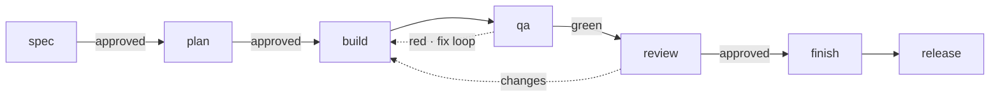

<p align="center">
  
</p>

# j-flow

[](LICENSE)


> Gate-based Spec-Driven Development for Claude Code — MongoDB + NestJS + React + Flutter.

## What problem does it solve?

AI coding assistants are fast but undisciplined: they implement features you never asked for, skip the spec, and leave no trail from requirement → code → test. On a real full-stack project that drift compounds fast.

j-flow puts **blocking gates** between every phase of a feature. You can't plan until the spec is approved. You can't review until QA is green. You can't finish until review passes. The workflow's state lives in an append-only `gate-context.md`, so neither you nor the model can quietly skip a step — every acceptance criterion stays traceable to a task, a test, and a commit.

## How it works

A **gate** is a checkpoint that must reach a required state before the next phase can start. j-flow drives one feature through seven phases, each guarded by a gate:



- **spec / plan / review** gates are approved by *you* — an explicit yes/no dialogue.
- **qa** is approved by *tests*: all 7 stages must pass (lint, unit, NestJS E2E, Flutter integration, Playwright E2E, visual smoke, manual checklist). Red bounces you back to `build --fix`.
- Each feature's gate state is recorded in `.specs/{slug}/gate-context.md` — append-only, the single source of truth that `/j-flow-check` reads. The model reads it too, so it can't advance a gate that isn't actually met.

## Install

```bash
# Add the marketplace (once)
claude plugin marketplace add https://github.com/jotafierro/j-flow

# Install the plugin
claude plugin install j-flow

# Update later
claude plugin marketplace update
```

To scope the plugin to a single project instead of globally:

```bash
claude plugin marketplace add https://github.com/jotafierro/j-flow --scope project
claude plugin install j-flow --scope project
```

> **Requirement:** `/j-flow-project` requires an existing git repository. Run `git init` first if needed.

## Your first feature

```
/j-flow-start checkout-coupons   # creates the feature branch + .specs/checkout-coupons/
/j-flow-spec                     # dialogue: what / who / trigger / acceptance criteria
                                 #   → writes functional-spec.md, waits for your approval   [GATE]
/j-flow-spec technical           # the architect agent drafts the technical spec            [GATE]
/j-flow-plan                     # breaks ACs into layered tasks + a manual review guide     [GATE]
/j-flow-build                    # implements data → service → api → ui → mobile, one commit per layer
/j-flow-qa                       # runs the 7 QA stages; red → /j-flow-build --fix → repeat  [GATE]
/j-flow-review                   # audits the code against the spec; changes → fix loop      [GATE]
/j-flow-finish                   # writes the feature README, updates CHANGELOG, opens a PR
```

At each `[GATE]` j-flow stops and asks — nothing advances until the gate is met. Run `/j-flow-check` anytime to see exactly where the feature stands.

## Quick Start

```
/j-flow-project           # one-time project setup (PRODUCT.md, DESIGN.md, agent memory, auto-triggers scaffold)
/j-flow-start {slug}      # begin a new feature
/j-flow-spec              # write functional spec via dialogue
/j-flow-spec technical    # write technical spec via j-flow-architect agent
/j-flow-plan              # generate task plan + review guide
/j-flow-build             # implement by layer (data → service → api → ui → mobile → infra)
/j-flow-qa                # run QA gate (7 stages, layer-aware — skips stages for untouched layers)
/j-flow-review            # code quality audit vs specs
/j-flow-finish            # README + CHANGELOG + PR to develop
/j-flow-release minor     # semver bump + tag + PR to main
```

## Skills

| Skill | Purpose |
|-------|---------|
| `/j-flow-project [--update] [--from FILE] [--from-design FILE]` | Define project — PRODUCT.md, DESIGN.md, agent memory; first run auto-triggers scaffold |
| `/j-flow-scaffold [--review]` | Generate monorepo scaffold (React + Vite, NestJS, Flutter); `--review` is read-only |
| `/j-flow-recommend` | Suggest plugins/tools for the workflow, then offer to start the next backlog feature |
| `/j-flow-start {slug} [--quick]` | Initialize feature — git branch, `.specs/{slug}/`, gate-context; `--quick` marks it fast-track (collapses redundant gate confirmations for small changes — never skips QA/Review or a blocking outcome) |
| `/j-flow-spec [technical\|--explore]` | Functional spec via dialogue → approval gate; `technical` generates technical spec; `--explore` for lightweight scoping before committing |
| `/j-flow-plan` | Task plan + review guide → approval gate |
| `/j-flow-build` | Layered implementation by domain agent, unit tests per layer |
| `/j-flow-build --fix` | Resolve QA or review findings |
| `/j-flow-qa` | QA gate — 7 stages, layer-aware (skips stages for untouched layers) — blocks review if red |
| `/j-flow-review` | Code quality audit vs technical spec |
| `/j-flow-finish` | Feature README + CHANGELOG \[Unreleased\] + PR to develop |
| `/j-flow-release [major\|minor\|patch]` | Semver bump + git tag + PR to main |
| `/j-flow-reopen` | Reopen feature to a prior gate |
| `/j-flow-update` | Update specs mid-feature, mark downstream gates stale |
| `/j-flow-check` | Current feature phase + gate status |
| `/j-flow-check --all` | All features summary |
| `/j-flow-check --repo [--verbose]` | Read-only repo health check — drift, missing artifacts, backlog vs gates inconsistency |
| `/j-flow-check --consistency [--verbose]` | Cross-consistency check — every AC has a task, every task has an AC, every AC has a test, no AC contradicts system spec |
| `/j-flow-eject [path]` | Copy a template / reference / agent into `.specs/.overrides/` for customization |

For the complete command-by-command workflow reference, see **[docs/FLOW.md](docs/FLOW.md)**.

## Stack

j-flow is **deliberately opinionated**: the build agents assume this exact stack. The *gate workflow itself* is stack-agnostic, but if your stack differs you'll need to adapt the domain agents — `/j-flow-eject` lets you override them without forking. See **[docs/adapting-your-stack.md](docs/adapting-your-stack.md)** for the full adaptation guide (and its honest boundaries). On MongoDB + NestJS + React + Flutter it works out of the box.

| Layer | Technology |
|-------|-----------|
| Database | MongoDB + Mongoose |
| Backend | NestJS (TypeScript strict) |
| Frontend | React + React Query + Zustand + Tailwind CSS (optional) or plain CSS |
| Mobile | Flutter + Riverpod + GoRouter |
| CLI | TypeScript + commander + tsup + vitest (optional, opt-in layer) |
| Testing | Jest, `@nestjs/testing` + supertest, flutter_test, Playwright, Storybook, Widgetbook |
| Infra | Docker Compose + GitHub Actions + Railway + Vercel |

## Project file structure

Key files generated in your target repo by j-flow:

| Path | Purpose |
|------|---------|
| `PRODUCT.md` | Product vision and tech stack (descriptive context) |
| `DESIGN.md` | Design system tokens and patterns (descriptive context) |
| `CONSTITUTION.md` | **Inviolable project principles** — enforced by `/j-flow-review` as a blocking gate. Generated by `/j-flow-project`. Descriptive context stays in PRODUCT.md/DESIGN.md; only restrictions go here. |
| `CHANGELOG.md` | Keep-a-Changelog format; updated by `/j-flow-finish` and `/j-flow-release` |
| `.specs/README.md` | Feature backlog with status symbols |
| `.specs/.agents/` | Per-agent memory files — accumulated learned patterns |
| `.specs/{slug}/` | Per-feature folder: `meta.md`, `gate-context.md`, specs, tasks, README |
| `.specs/_system/` | **Living system spec** — one file per domain (e.g. `auth.md`, `users.md`). Accumulates Acceptance Criteria from every finished feature. Auto-updated by `/j-flow-finish`. Read by `/j-flow-spec` as the behavioral baseline to avoid contradictions. |
| `.specs/.overrides/` | Ejected plugin assets (`/j-flow-eject`), edited per target repo. **Trust surface equivalent to executable code** — an overridden agent definition fully controls that agent's behavior when dispatched (tool-scope-ceilinged, never widened; see `references/overrides.md`). Review a change here like you'd review a code change, not a doc change. |

## Validate plugin structure

```bash
node tests/validate.js
```

Checks all skills, agents, shared templates, and references have valid structure and frontmatter. No LLM required.

## Contributing

Issues and suggestions are welcome. If you open a PR, run `node tests/validate.js` first and keep to Conventional Commits. See [`.github/CONTRIBUTING.md`](.github/CONTRIBUTING.md) for details and [`.github/SECURITY.md`](.github/SECURITY.md) to report a vulnerability.

## Credits

Created by [Jonathan Fierro](https://jotafierro.me). Licensed under [MIT](LICENSE).
